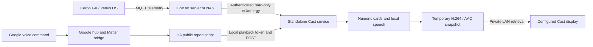
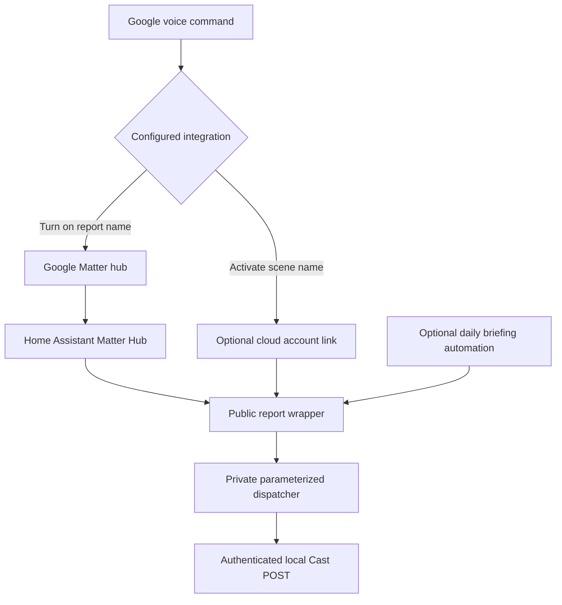
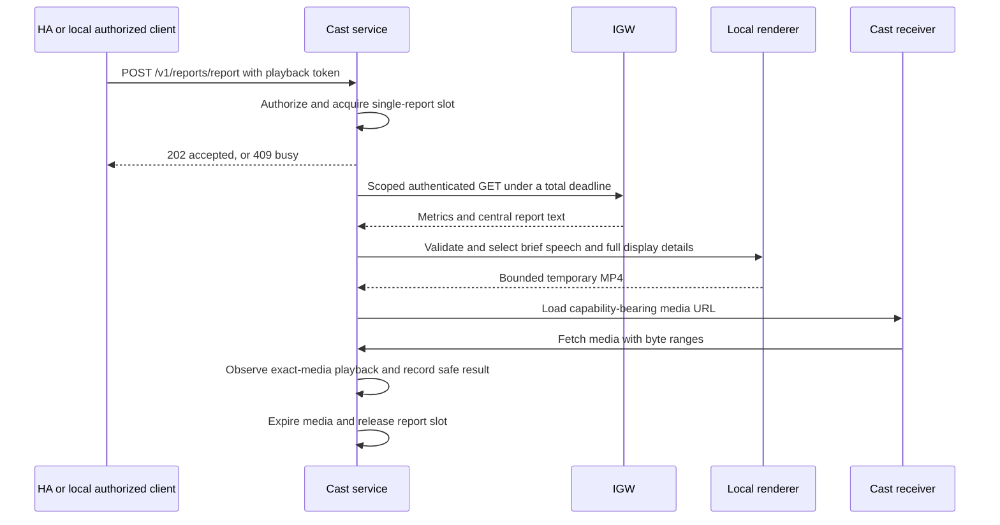
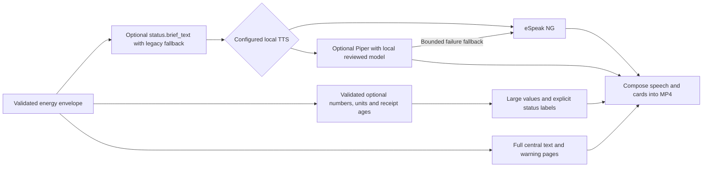
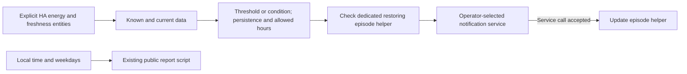

# Google energy reports architecture

This project provides read-only report presentation and playback. The standalone
Cast service can run without Home Assistant. Google voice triggering uses an
existing Matter or cloud integration; Cast alone does not implement voice intents.

## Components and data ownership

IGW owns source selection, energy calculations, report wording and freshness.
The NAS renders media; Cerbo runs no speech model or renderer. HA is a small
trigger layer in this route and stores only the local playback token. The Cast
service holds the IGW read credentials and optional Cloudflare Access credentials.

The original HA speech adapter is an alternative: HA reads IGW and passes the
report to an existing TTS provider and speaker. Do not install both generated
packages with duplicate entity IDs. See the [setup guide](README.md).

## Google trigger paths

The five existing wrappers and names remain the default. `--include-flow` adds
one explicit power-flow wrapper; commissioning and exposure remain separate
operator steps. Keep the dispatcher private and preserve existing Matter
endpoint identities. The optional `Energy` display-name override preserves the
status script's entity ID. Bare voice starters require personal Google routines.

Each service instance targets one configured receiver. The originating microphone
does not automatically select another output room. The MP4 is a snapshot, so it
does not provide Alexa-style report buttons or an interactive web dashboard.

## Playback, authentication and resource bounds

HTTP acceptance is not playback proof. Verification follows the new media URL
through receiver `PLAYING`, advancing playback time and the service's result.
Physical screen appearance, audibility and microphone recognition are separate.

The local API is restricted to a trusted LAN. Media capability URLs are temporary
and must remain private because receivers cannot attach the API token. Requests
are not queued into overlapping playback. Process, file, time and memory bounds
remain important on a NAS. At most one classified transient IGW read retry fits
inside the existing overall deadline; authorization and invalid data are not retried.

## Numeric cards and local speech

The source receipt age is distinct from envelope generation time and physical
sampling time. Unavailable, stale and unconfigured readings retain their meaning.
The renderer never extracts numbers from prose or replaces missing data with zero.
Brief speech does not remove full on-screen warning explanations.

Piper is optional, uses local model files, and does not download a model for a
voice request. Check its software and selected voice-model licenses. Benchmark
the actual NAS before changing its default engine. See the
[Piper installation instructions](docs/standalone-cast.md).

## Optional notifications

Notification blueprints use explicitly selected HA sensors and freshness signals;
they do not add IGW polling or credentials to the Cast trigger. This is a separate
optional automation path. Grid-loss alerts require a real condition sensor, not
an inference from zero grid power. Reserve recovery uses a separate threshold.
The default notification stays in HA; phone recipients are selected by the operator.
The blueprints are templates and are never enabled by rendering files. See
[automation setup and limitations](docs/automations.md).

## Upgrade and verification

Upgrade IGW first when enabling additive brief or flow reports. Existing gateways
and five-report configurations remain usable. Install a reviewed local Piper
model only if opting in. Preserve the existing display identity and HA/Matter
configuration when updating the service.

Validate unit tests, real offline media generation, package installation and HA
configuration for both adapters with and without flow. Exercise one actual
receiver before relying on microphone acceptance. For automation templates,
test synthetic helpers and the selected notification service before using live
thresholds. No test fixture needs real credentials or household values.

Rollback uses the previous service image and HA package. Disable only the newly
created optional automations. Retain the bridge pairing, established public
entity IDs, secrets and unrelated services.
